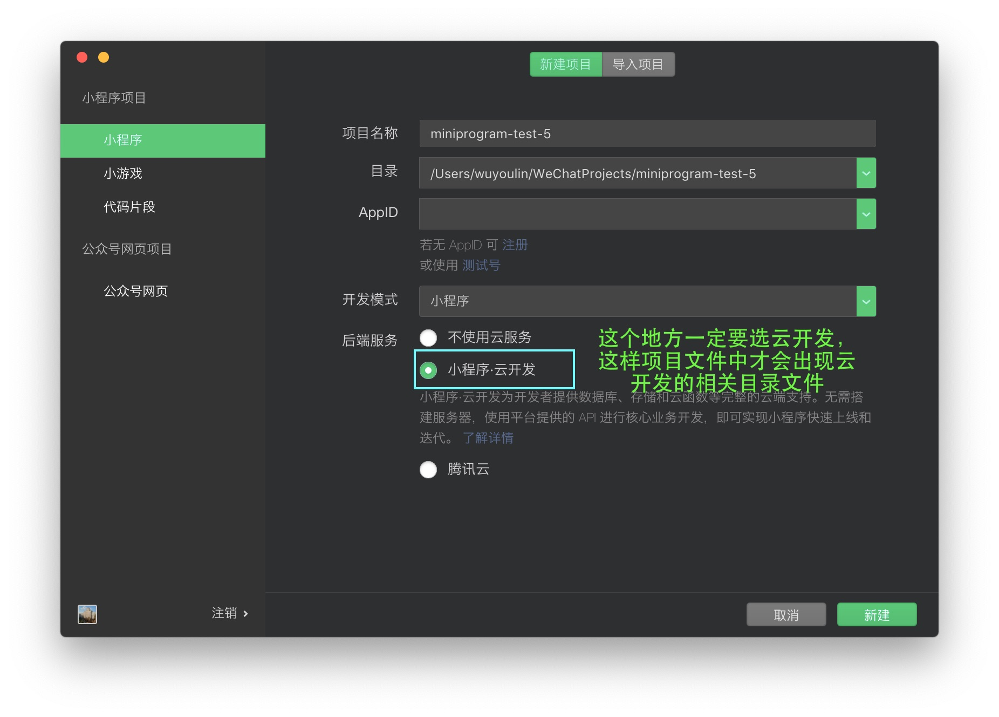

# 使用云函数作为强智教务系统API请求中转
## Preface/前言
众所周知，微信添加小程序功能后对传统的app市场造成了一定的冲击，但机遇和挑战并存，小程序带来的更多的是小众性强、功能单一、硬件资源消耗少的手机应用的开发便利性。正是基于此，以小程序为技术依托的大学校园服务类应用开始大规模出现。但是由于各个学校网络信息技术难免有高有低，**有的学校使用了https技术对网络请求进行加密，而大部分学校仍然使用了传统的http请求。最新的小程序开发标准中已经禁止直接发起http请求，** 因此亟需寻求一种解决方案。

常规的解决方案是增加一台代理服务器，但这会涉及到购买域名、购买安全证书等一系列开销和维护问题，因此作者尝试利用腾讯免费提供的小程序云开发中的云函数功能实现目标。如果你有更好的解决方案，欢迎与我讨论。电邮mzlwuyoulin(at)gmail.com (将（at）替换成@)

## Startup/开始
**创建项目文件** 
