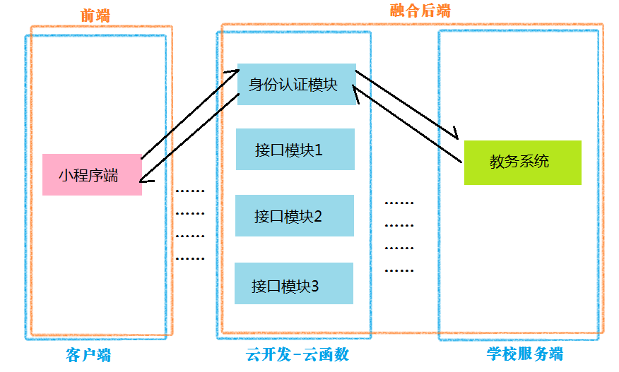

# 使用云函数作为强智教务系统API请求中转
## Preface/前言
众所周知，微信添加小程序功能后对传统的app市场造成了一定的冲击，但机遇和挑战并存，小程序带来的更多的是小众性强、功能单一、硬件资源消耗少的手机应用的开发便利性。正是基于此，以小程序为技术依托的大学校园服务类应用开始大规模出现。但是由于各个学校网络信息技术难免有高有低，**有的学校使用了https技术对网络请求进行加密，而大部分学校仍然使用了传统的http请求。最新的小程序开发标准中已经禁止直接发起http请求，** 因此亟需寻求一种解决方案。

常规的解决方案是增加一台代理服务器，但这会涉及到购买域名、购买安全证书等一系列开销和维护问题，因此作者尝试利用腾讯免费提供的小程序云开发中的云函数功能实现目标。如果你有更好的解决方案，欢迎与我讨论。电邮mzlwuyoulin(at)gmail.com (将（at）替换成@)



## Startup/开始
**创建项目时请选择“小程序·云开发”**
由于云函数使用node.js编写，原生的网络请求功能不能满足我们的需求，因此我们需要使用npm扩展包。关于本地的node.js和npm环境搭建请自行百度。
  
*  在项目详情中勾选使用npm模块
*  新建一个云函数
*  在云函数文件夹右键菜单中选择“终端中打开”
*  在终端中输入并等待安装完成

```bash
$ npm install --save got
```
> $是终端提示符，打命令的时候不要打上去！！

## Application/应用
这里仅仅给出了**登陆接口** 的使用方法，其他接口的写法可以参考[这里](https://github.com/wylapp/QZapi_py).需要特别注意的是云函数返回数据的格式及解析方法。目前我对链接地址采用的是按字符串处理，但是应该有更好的处理方法。

**请注意，这里只给出了我们需要编写的部分，其他程序自动生成的文件没有包含，在实际应用中，对于云函数只有其目录下的index.js是需要我们编写的，其余部分不要动。**

完成后，右键点击云函数目录并选择“上传并部署：云端安装依赖”，上传成功后，云函数就能在云端正常工作了！


